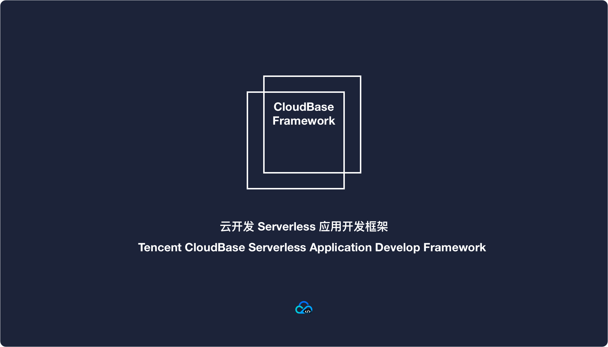
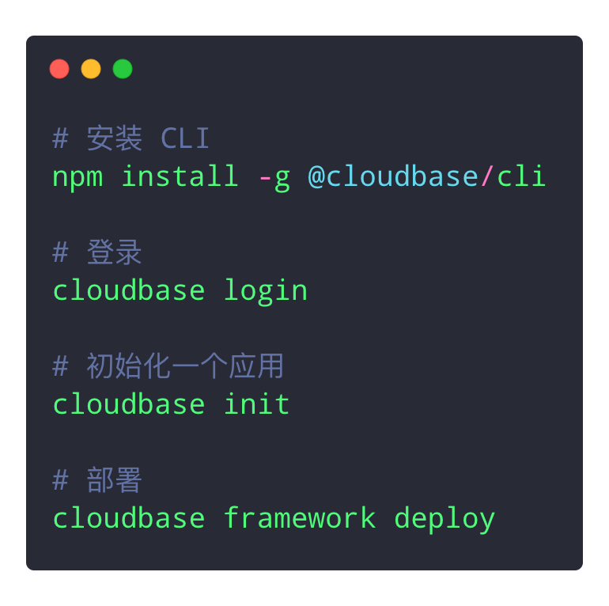

[](LICENSE)
[](https://www.npmjs.com/package/@cloudbase/cli)
[](https://lernajs.io/)
[](https://www.npmjs.com/package/@cloudbase/cli)
[](https://github.com/TencentCloudBase/cloudbase-framework/issues)
[](https://github.com/TencentCloudBase/cloudbase-framework/pulls)
[](https://github.com/TencentCloudBase/cloudbase-framework)

[官网](http://cloudbase.net) / [文档](https://docs.cloudbase.net/) / [社区](https://cloudbase.net/community.html)



**CloudBase Framework** 云开发 Serverless 应用开发框架，开箱即用，方便开发和部署多端+全栈的 Serverless 应用

## Table of Contents

- [快速开始](#quick-start)
- [示例](#examples)
- [插件](#plugins)
- [License](#license)

## <a name="quick-start"></a> 快速开始

1. **安装 CLI**

```bash
npm install -g @cloudbase/cli
```

2. **登录**

```bash
cloudbase login
```

3. **初始化一个应用**

```bash
cloudbase init
```

4. **部署应用**

```bash
cloudbase framework deploy
```

## <a name="examples"></a>示例

## <a name="plugins"></a>插件

| 插件 |  最新版本  | 插件介绍       |
| ------ | ------ | ----------- |
|   [@cloudbase/framework-plugin-website](packages/framework-plugin-website)  |  [](https://www.npmjs.com/package/@cloudbase/framework-plugin-website)     | 前端页面插件 |


## <a name="license"></a>License

[Apache License 2.0](./LICENSE)