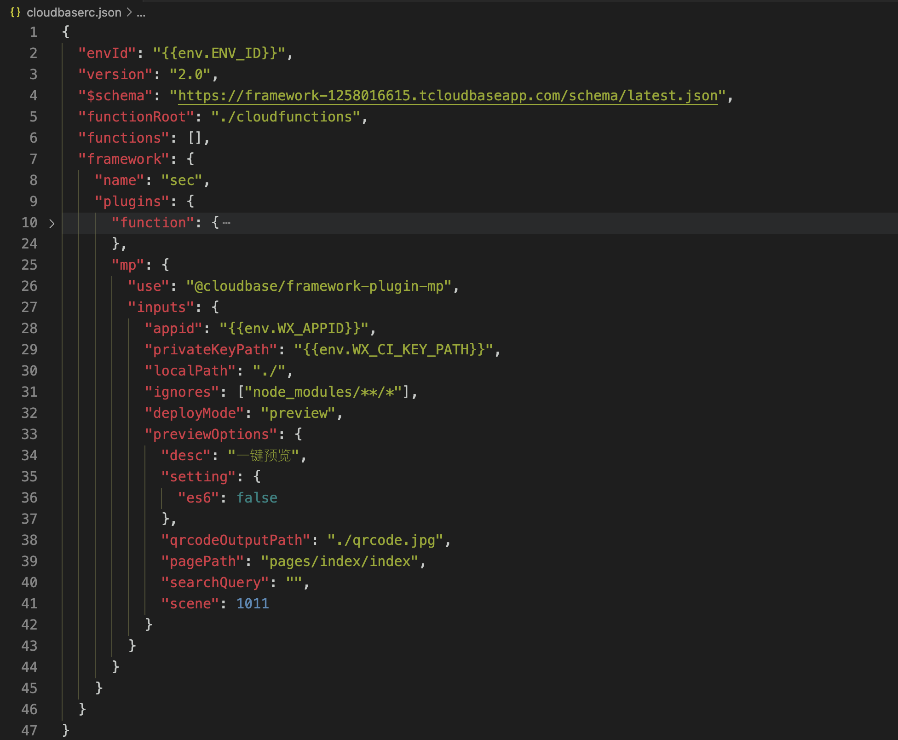
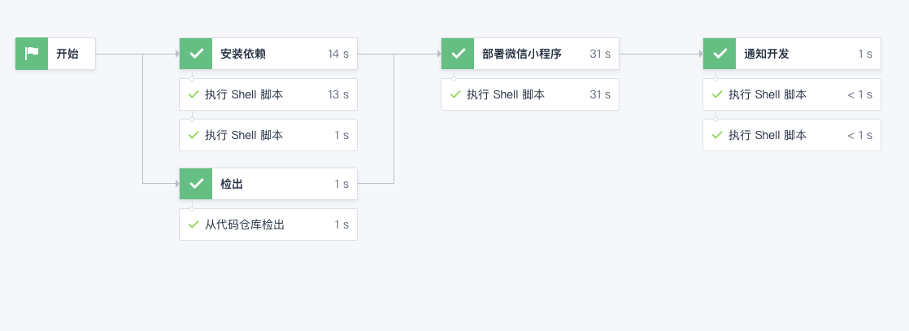
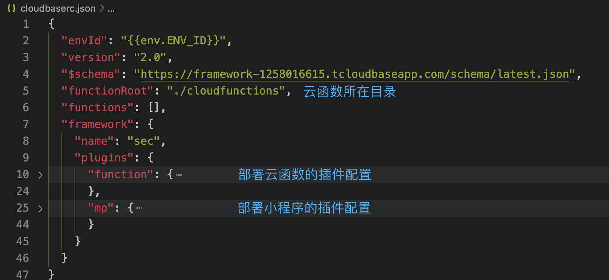
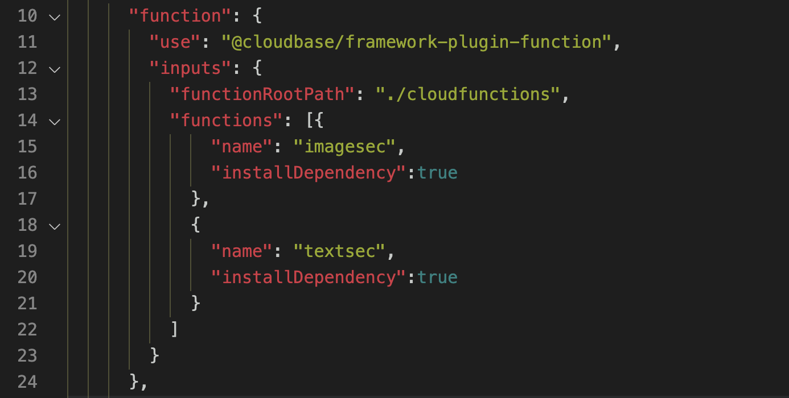
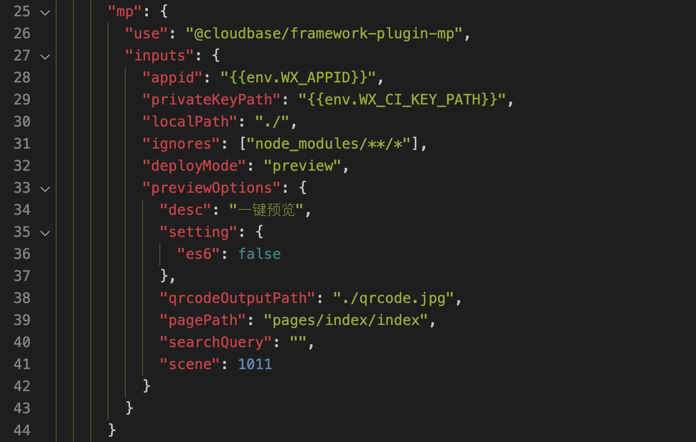
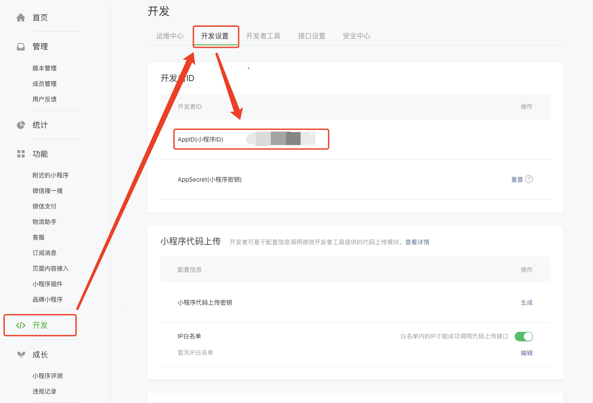
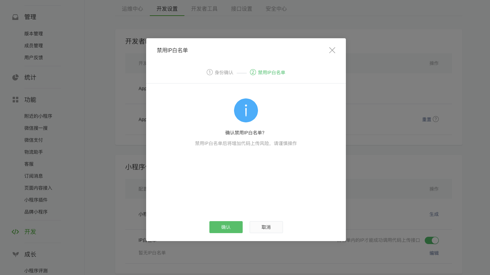
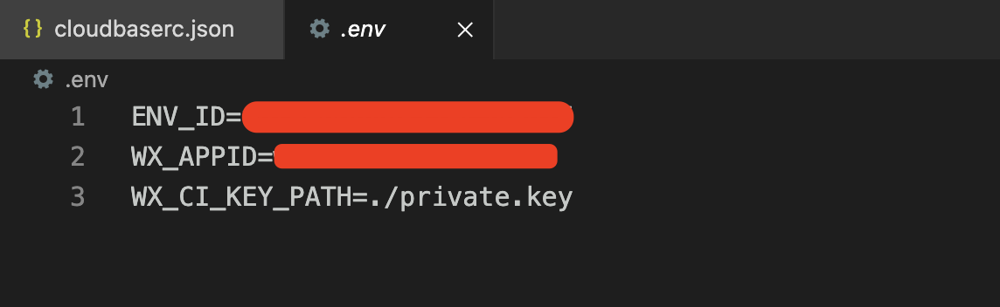
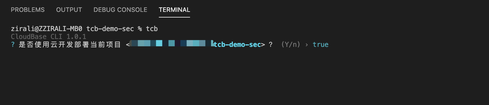
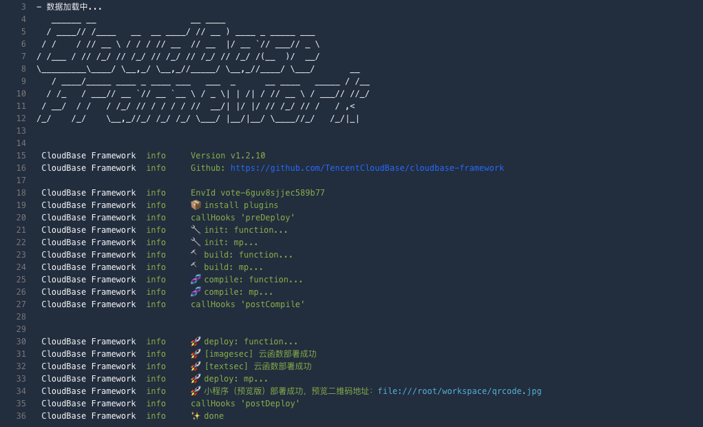

# 小程序·云开发地表最强CI利器来了

## 小程序CI 与 CloudBase-FrameWork

从2017年开始，微信小程序的能力也随着前端的大发展的趋势越来越多，包体积限制越来越宽松，大型微信小程序的开发团队越来越多，为了适应形式，微信小程序官方团队在2020年1月推出了官方CI工具，可以进行代码上传、预览、拉取关键信息等操作，甚至还能简单的做云开发云函数的上传工作。

这对于大型小程序开发团队来说是好消息，其总算解决了微信小程序的工程化协作开发的历史难题。

云开发作为微信小程序的最佳后端云服务，单靠小程序CI工具，还是不能有效满足基于云开发进行小程序开发的协作问题，因为云开发所要涉及的，可是整个的后端服务，包括数据库等各项基础配置。

云开发以支持微信小程序为起点，朝全平台应用服务支持迈进的同时，也在CI方面做了相应的工作，推出了云开发专门的CI工具—CloudBase-FrameWork，是前后端一体化的部署工具，不止可以进行云开发相应能力的部署，还可以做前端项目的部署工作。

现在，CloudBase-FrameWork支持部署微信小程序，除次之外，你还可以部署微信小程序所需要的全部云开发能力，包括云函数、数据库、存储等各种能力。同时，如果你的项目是一个跨平台的产物，还有WEB以及APP产品，CloudBase-FrameWork也可以一次性完整的为你部署。

在项目开发协作中，除了业务代码之外，只需要在配置文件中进行相应配置，CloudBase-FrameWork就可以自动完成相应部署工作。

所以，使用云开发作为后端服务的微信小程序开发团队，可以完全不用自己建设，直接使用即可。以下是小编在Coding中使用CloudBase-FrameWork的持续集成流程配置

配合企业微信的群机器人，在开发成员push代码后，自动构建并提醒开发者进行预览。

## 如何使用CloudBase FrameWork部署微信小程序

接下来小编就带大家简单实践一下，如何使用CloudBase-FrameWork部署微信小程序

步骤一：获取代码
点击进入[项目地址](https://github.com/TCloudBase/WXAPP-SecCheck)，获取实践的源码。这是一个比较简单的小程序，通过云开发·云调用提供的安全检测能力进行文字和图片的安全检测。

步骤二：配置cloudbaserc文件
项目的根目录中，有cloudbaserc.json文件，这是CloudBase-FrameWork工作的保障和依据。

其中，envId是云开发环境id，示例是通过环境变量引入形式给定的值，在实际部署时会被变量的值所替换。

插件是cloudbase-framework执行部署时发挥作用的模块，在示例项目中，只有部署云函数和部署小程序两件事情。

function插件主要用于部署云函数，示例项目中有两个云函数，根据业务要求进行相应配置，framework就会按照配置进行部署工作。

详细的部署文档可以参考[官方文档](https://github.com/TencentCloudBase/cloudbase-framework/tree/master/packages/framework-plugin-function)

mp插件用于部署微信小程序，其将小程序有关代码打包上传，并返回相应的预览二维码。除了上传小程序所必要的配置信息，返回的二维码保存的地址也可配置。

详细的部署文档可以参考[官方文档](https://github.com/TencentCloudBase/cloudbase-framework/tree/master/packages/framework-plugin-mp)

以上所有配置文件如果无特殊想法无需修改。

步骤三：创建env文件
在示例项目的根目录创建.env文件，设置自己的环境变量参数，包括云开发的环境ID，小程序appid，以及小程序代码上传私钥。具体效果如下：
ENV_ID=替换你的云开发环境ID
WX_APPID=替换你的微信小程序appid
WX_CI_KEY_PATH=小程序上传密钥文件路径

小程序appid是一个微信小程序的关键标识信息，可以在开发者后台的开发栏目里看到，如下图所示：

而小程序代码上传密钥，在appid的信息下方，点击生成按钮，经过微信验证下载密钥文件，将文件重新命名为private.key，放置在示例项目根目录下。另外，代码上传的IP白名单需要关闭。

如果你想保持打开，可以在第一次framework部署时出现拒绝错误，将返回的ip地址（也就是你自己的本机ip地址）放置到白名单中。

云开发需要使用微信开发者工具提前开通，注意保存云开发环境ID信息。最终，配置的信息如下所示：

步骤四：安装依赖
framework是集成在CLI工具中的，所以需要npm全局安装CLI工具，执行如下命令：
npm install -g @cloudbase/cli@latest

之后，直接执行tcb即可自动检测并部署，选择Y，继续部署

之后，cloudbase-framework就根据配置文件的要求进行部署，并将小程序的预览二维码保存到规定的地方。

不止简单的CI工具
如此，你便从本地完成framework自动化部署的过程。当然除了示例项目简单的云函数、微信小程序部署，cloudbase-framework还可以同时完成更多的事情。比如部署数据库、云托管、Nuxt SSR应用、Deno应用、Node应用等等，具体可以直接到[官网](https://github.com/TencentCloudBase/cloudbase-framework)获得

不仅如此，CloudBase-FrameWork还推出了一键部署功能，特别适合开源项目使用。体验者只需要点击部署按钮，CloudBase-FrameWork会直接跳转腾讯云控制台，引导体验者一步步的填写部署所需信息（包括选择环境，填写小程序appid等），直接拉取开源代码进行安装部署，彻底解决了因为体验者经验不同导致开源项目千人千面的窘迫境地。

如果你所在的开发团队还没有get这个最强利器，还等什么呢？

点击下面地址，尝试示例项目部署安全检查小程序
[https://github.com/TCloudBase/WXAPP-SecCheck](https://github.com/TCloudBase/WXAPP-SecCheck)

## CloudBase Framework 开源项目介绍

🚀 CloudBase Framework 是云开发开源的云原生前后端一体化部署工具，支持主流前后端框架，前后端一键托管部署在云端一体化平台，支持支持小程序、Web、Flutter、后端服务等多个平台。

Github 开源地址：[https://github.com/TencentCloudBase/cloudbase-framework](https://github.com/TencentCloudBase/cloudbase-framework)

欢迎给 CloudBase Framework 一个 🌟 star 

## CloudBase Framework 核心贡献者计划

欢迎大家参与 CloudBase Framework 的开发工作，成为我们的贡献者，我们将会在云开发社区展示贡献者的作品和信息，同时也会有惊喜奖励。

您可以选择如下的贡献方式：

- 贡献技术文章：[https://github.com/TencentCloudBase/cloudbase-framework/tree/master/community/posts](https://github.com/TencentCloudBase/cloudbase-framework/tree/master/community/posts)
- 贡献应用：[https://github.com/TencentCloudBase/cloudbase-framework/blob/master/doc/app.md](https://github.com/TencentCloudBase/cloudbase-framework/blob/master/doc/app.md)
- 贡献代码，提交 Pull Request
- 反馈 bug，提交 Issue
- 在技术会议上发表技术演讲

CloudBase Framework 的发展离不开社区的积极贡献，这是我们的核心贡献者列表，再次感谢大家的贡献：[https://github.com/TencentCloudBase/cloudbase-framework#contributors-](https://github.com/TencentCloudBase/cloudbase-framework#contributors-)