# :-: 基于云原生技术构建去中心化SaaS产品

近两年随着C端流量饱和，B端业务成为寻找新增长点的重要领域，而在to B业务中，SaaS产品又是极其重要的一个组成部分。UCT作为一家多年SaaS产品的厂商，在近年基于云原生技术开发的实践中，看到了一些SaaS产品发展的新契机，在此分享我们的一些最佳实践。
业内人士都有共识，国内的SaaS产业环境与国外有很大不同，国内SaaS厂商的盈利能力普遍不佳，甚至一些已上市的SaaS厂商都还在连年亏损。究其原因，固然有SaaS产品复杂度高，客户需求多样且多变，市场虽在快速增长但总体规模仍然不大等复杂原因，但深层次的根本问题，我认为还是在于技术能力与底层商业逻辑无法满足市场需求。
## SaaS成熟度模型
传统的SaaS成熟度模型分为四级（从0级开始编号）[[1]](#anchor1 "SaaS成熟度模型")：

Level 0.定制开发
Level 1.可配置
Level 2.可配置、多租户
Level 3.可扩展、可配置、多租户
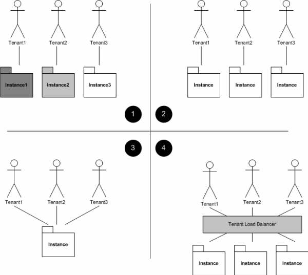  

:-: *图1.SaaS成熟度模型*  

后有专家评论，用不同的诠释方式，在以上四级后添加了第4级[[2]](#anchor2 "SaaS成熟度模型level4")：，
Level 0. (Chaos 混乱的)  
Level 1. (Managed Chaos 受控的混乱)  
Level 2. (Multi-Tenant, Highrise 单实例多租户)  
Level 3. (Multi-Tenant, Build-Out 可扩展多租户)  
Level 4. (Utopia): This is like Level 3, except you've figured out an efficient way to run different versions of the software on different "instances".  
译文：level4（乌托邦）：如同第 3 级，除非你可以找出有效的方式，以在不同的“实例”上运行不同版本的软件。一句话道出了事情的本质。  
随着近年云原生技术体系的发展和商业化落地，我们初步看到了实现乌托邦级SaaS产品的可行性。UCT于2019年中开始组织开发人员参与小程序云开发的技术培训和学习，至2020年开始全面采用小程序云开发技术进行项目和产品的开发。通过具体的开发实践，在此总结level4级SaaS产品的主要特点。  
## 乌托邦级SaaS成熟度特点
1. 去中心化架构。  
涉及租户的具体应用，并没有任何需要中心化的节点参与其中。云基础设施提供商通过IaaS/PaaS/SaaS的分层解耦，实现了SaaS层的去中心化。  
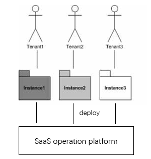  

:-: *图2.去中心化SaaS产品架构*    

2. 运营与应用分离。
SaaS产品的运营域与应用域明显分离。SaaS厂商的运营支撑系统主要实现业务运营所需的功能，例如，租户业务受理、应用/服务购买、应用配置/部署、渠道管理等。具体租户使用的应用实例，可以像单租户产品一样开发，无需考虑复杂的数据分隔、负载均衡等，每个租户部署的实例都是程序和数据完全独立的实例。

3. 应用模板遵循统一开发规范，可商业化分发和部署，可实现跨服务商间的应用集成。
SaaS生态体系的全景图大致是这样。
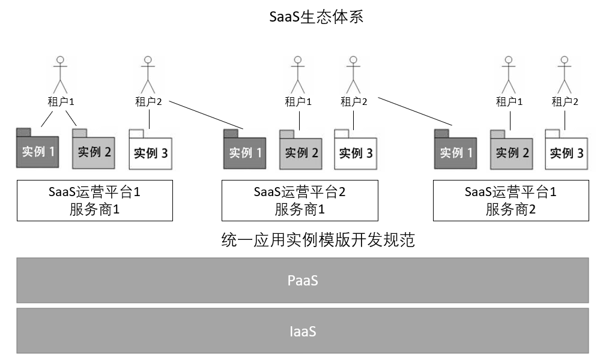   

:-: *图3.Level 4 SaaS生态体系全景图*   
一个SaaS服务商可以运营多个SaaS平台。每个租户可以通过应用实例模板部署具体的应用实例，每个应用实例都是私有化的程序和数据归属。生态体系遵循统一的应用实例模板开发规范。应用实例还可以在服务商间进行集成。

4. 灵活的计费模式，可以按需计费。
不仅可以实现传统的按时长、按功能/模块、按用户量等计费模式，还可精细化到按需计费按资源用量计费。

5. 低代码且高度可配置。
应用实例模板的开发遵循微服务、数据/业务/表现层分离（前后端分离）、高度可配置、面向租户低代码等的开发理念。

6. 高安全性、高可用性。
得益于去中心化、运营与应用分离、实例间相互独立/资源隔离、PaaS/IaaS提供高水平SLA等的保障，显著提高了每个租户的安全性和可用性。

7. 适用于所有类型的用户。
SaaS应用不仅可以满足预算有限的小微企业，还可以适用于有较多预算的大中型企业，如有必要，可以实现代码级的定制需求。

8. 技术及厂商中立。
客户的需求永远是分散和多元化的，SaaS服务商无法限定客户必须在哪个生态中开展业务和拓展用户，因此乌托邦级的SaaS应是技术及厂商中立的，在一个生态中的最佳实践，可以较快的复制到其他生态中，为客户提供持续一致的产品和服务体验。

9. 社会化生产
生产力与生产关系之间的普适规律永远有效。乌托邦级的SaaS产品应能支持厂商、客户、开发者的广泛参与，以与去中心化生态体系相匹配的方式实现社会化的生产和运营。因此开源应是这一级产品的重要特征，但也需有技术和监管保障所有参与方的知识产权、数据所有权以及商业利益受到保护。

在实现乌托邦级后，SaaS 5 级成熟度模型对比[[3]](#anchor3 "SaaS 5 级成熟度模型对比")：
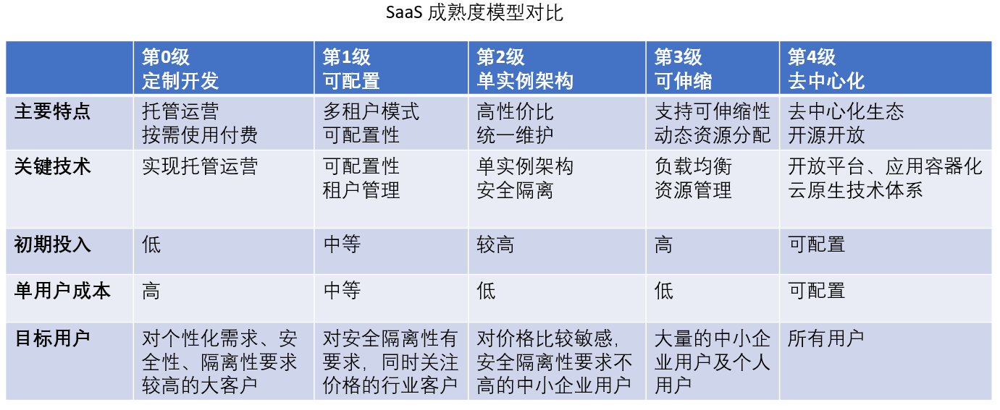  

:-: *图4.Level 4 SaaS成熟度模型对比*

## 微信生态里的工程实践
回顾微信服务商生态的发展历程，基本吻合了SaaS成熟度从0到4级的一个升级过程。
UCT成立于2014年，当时微信用户正在高速增长，微信公众平台推出不久，市场上微信营销、微信自媒体的风潮开始火热。基于微信公众平台（mp.weixin.qq.com）进行H5应用开发的需求高涨，一批微信服务商开始涌现。然而，当年受限于技术发展水平，服务商大部分都是项目定制开发阶段，甚至微信官方的文档和sdk都错误不少，因此，也出现了一些第三方的SDK和开发框架，帮助客户和开发者降低微信应用的开发复杂度提高开发效率。微信生态基本上是一种混乱的野蛮生长，缺少规范和监管的状态。
 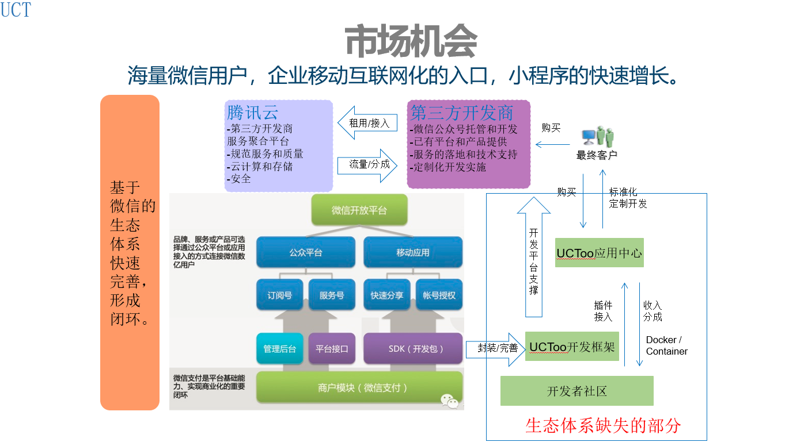   

:-: *图5.微信生态缺失的部分*

上图取自UCT商业计划的2015年版本，这些年来几乎没怎么变过，只在小程序产品出现后修改了几个字。
2015年，微信推出了微信开放平台(open.weixin.qq.com)，第三方开发商初步有了较为一致的服务接入能力，第三方开发商的产品也开始初步SaaS化，开始支持多租户和一定程度的可配置。
发展到2017年，第三方开发商逐渐细分赛道，开始做一些垂直行业解决方案，此时的SaaS产品已经有了比较成型的产品架构和服务体系。SaaS产品基本达到了level2的水平。
这一年微信小程序的发布，为第三方服务商注入了新的动力，基本上从生态级别提供了较为一致的开发规范，真正补足了微信生态体系缺失的部分。各第三方服务商开始支持基于小程序的产品和解决方案。
随着最近两年微信小程序云开发的逐渐成熟，及其背后腾讯云CloudBase云原生技术的广泛采用，为微信生态的服务商实现level4级SaaS产品奠定了基础。

## 腾讯云云原生技术体系符合乌托邦级SaaS需求的主要特性
1. 去中心化
微信生态本身就是去中心化的，微信官方形容这是一个繁荣的森林，不会存在参天大树遮蔽了花花草草的成长，再小的品牌都能在微信生态有成长的空间，如今微信生态依然是经营私域流量的首选阵地。
与此相对应的，采用云开发技术实现的微信小程序，帐号和数据都是归属租户所有的。租户授权小程序/公众号到第三方平台，由第三方平台代为实现业务，在第三方平台将小程序模版，云函数、数据库部署到租户小程序帐号和小程序云开发环境后，商户应用与第三方SaaS平台就可以不存在必然关联关系了。
 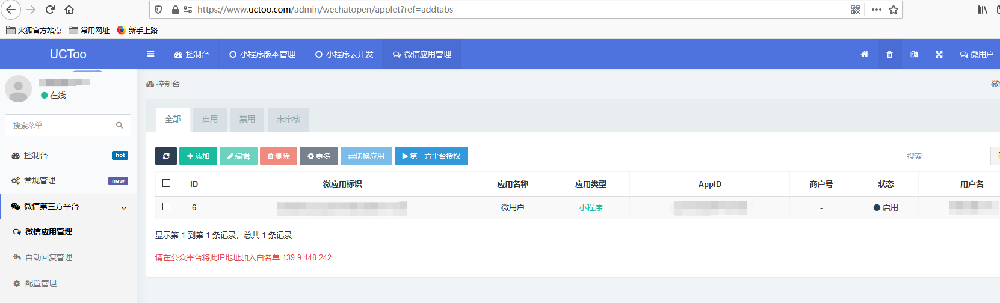   

:-: *图6.租户授权小程序/公众号至第三方平台代为实现业务*

2. 运营与应用分离
微信第三方平台服务商的运营支撑系统，主要面向平台运营人员以及渠道等运营营销参与者进行设计和功能开发。例如，实现租户管理、租户业务受理、小程序/公众号的授权管理、应用/服务购买、应用配置/部署、渠道管理等。
SaaS服务商具体提供给租户使用的应用，简化成第三方平台小程序模板的开发。可以是完全采用云原生技术的包含云函数、云数据库的资源包。也可以是开发商原有已开发的产品进行应用容器化升级后的产品。而且传统的ISV只需要少量的技术升级和适配即可将已有产品接入成level4级SaaS生态的组成部分，可以最大程度的保护已有开发成果。可以采用云托管将应用实例docker部署给租户。
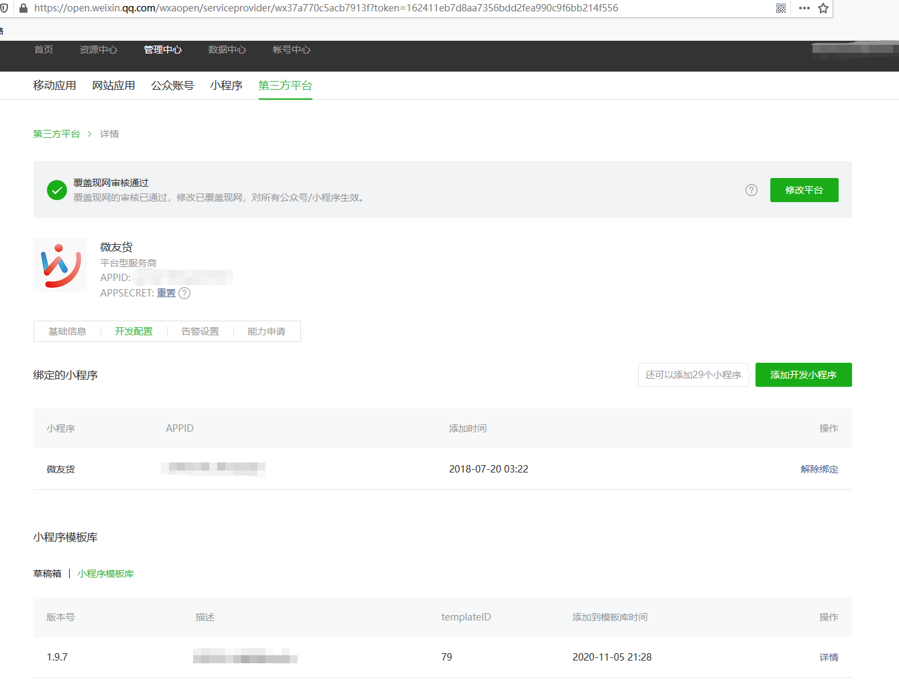   

:-: *图7.第三方平台小程序模板管理*

3. 统一开发规范
微信小程序提供了一套基本一致的开发技术体系，小程序中支持插件机制，同时商户的帐号开发权限集可以授权给多个第三方服务商，小程序的开发可以实现搭积木的效果。例如，需要开通直播功能、发票功能的小程序，只需要几行代码就可以集成微信官方的直播组件或者其他第三方服务商开发的发票插件，客服插件等等。微信官方还组织了第三方平台服务市场，商户可以寻找适合自己业务的产品和解决方案。
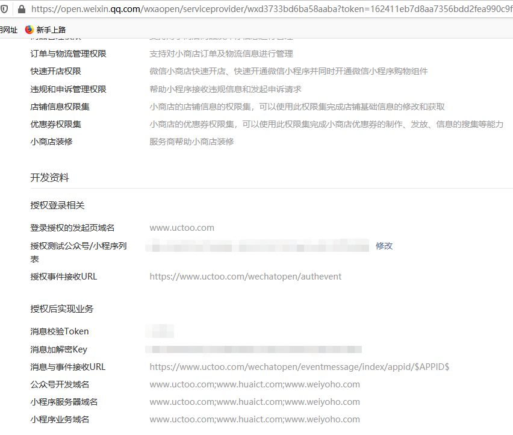  
 
:-: *图8.第三方平台开发权限集*

 应用实例还可以在服务商间进行集成，小程序云开发甚至从PaaS层面提供了插件的更新和依赖机制。至于服务商间应用的商业化分发和部署好像还没有什么实现案例。
 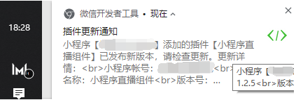  

:-: *图9.插件更新*

一个第三方平台帐号目前可以发布5个第三方平台，一家SaaS厂商可以按行业或功能集形成行业解决方案。微信开放平台中，不同第三方平台的小程序模板是相互隔离的，第三方开发商没有技术方式获取到其他第三方平台小程序的源码。
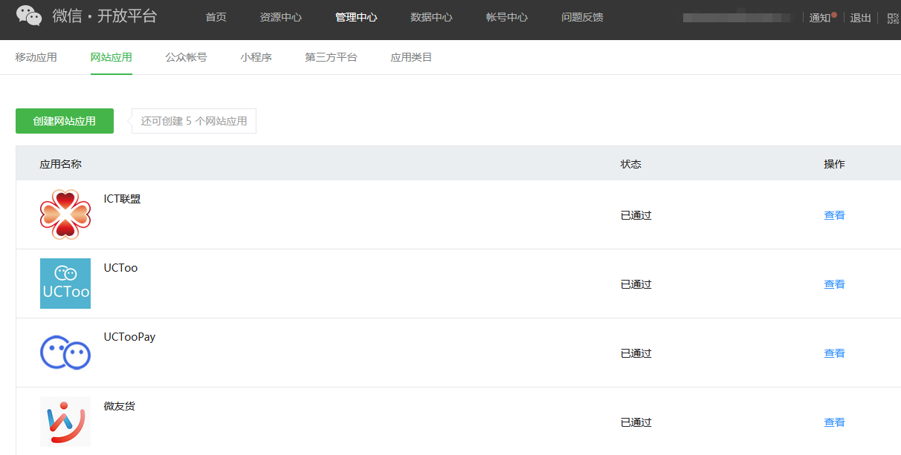
 
:-: *图10. 一家SaaS厂商发布的第三方平台*

4. 按需计费
传统SaaS产品很难实现按需计费。让本身没什么预算的小微企业每年支付几千上万的SaaS租用费，对他们可能有些压力，更何况购买的SaaS产品可能根本没有多少业务量，更没有带来预期的价值，可能这也是很多SaaS产品续费率低的原因。包年套餐的付费模式更是将个人用户挡在了门外。而对于一些自带流量的大客户，就算SaaS厂商收取每年几万的最高级资费套餐，也难以覆盖客户百万千万级的用户对SaaS资源的消耗量。这可能也是很多SaaS厂商GMV的增长并未带来收入的正比增长，反而带来巨大的基础设施投入成本的重要原因。
而采用小程序云开发，就由PaaS基础设施提供了精确到资源实际消耗量的计费能力。甚至入门的基础版套餐都是免费的，使得实现每个人的小程序提供了可能。
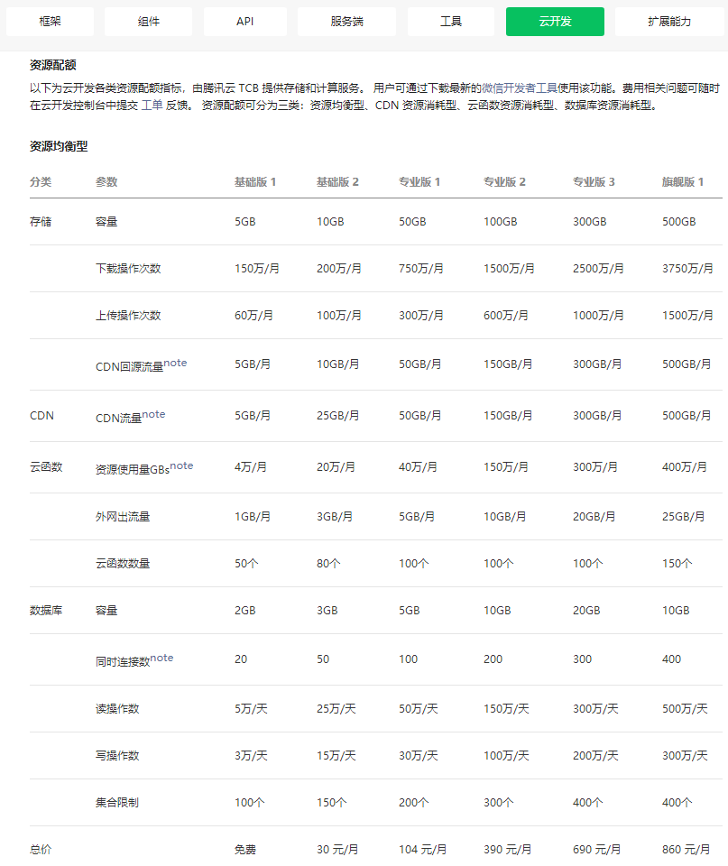  

:-: *图11.小程序云开发资费套餐*

5. 低代码/高度可配置
从用户的视角来说，SaaS租户多数不具备很高水平的IT技能，这就要求SaaS的应用开发商，应尽可能的实现功能配置和运营的简化、可视化、移动化。租户不仅可以实现自助服务，降低运营成本，在租户自己无法完成必要的操作时，实施人员或者客服也可以快捷的代为完成一些配置。在UCT已实施的SaaS案例中，就有实现了很少的运营人员即可支撑一个垂直行业SaaS平台运营的案例，极大提高了ROI。
从开发的角度来说，应尽可能的合理拆分应用服务的颗粒度，提高代码、模块的复用度。如能总结一类业务和操作的共性，最好可以实现代码的自动化生成机制，提高开发效率，向实现AI编程、填空式编程的方向发展。在微信第三方小程序模板的开发中，小程序模板定义了小程序的能力集，具体商户通过各自的个性化配置和模板装修获得自定义的ext_json，最终发布成符合自身需求的小程序应用实例。
 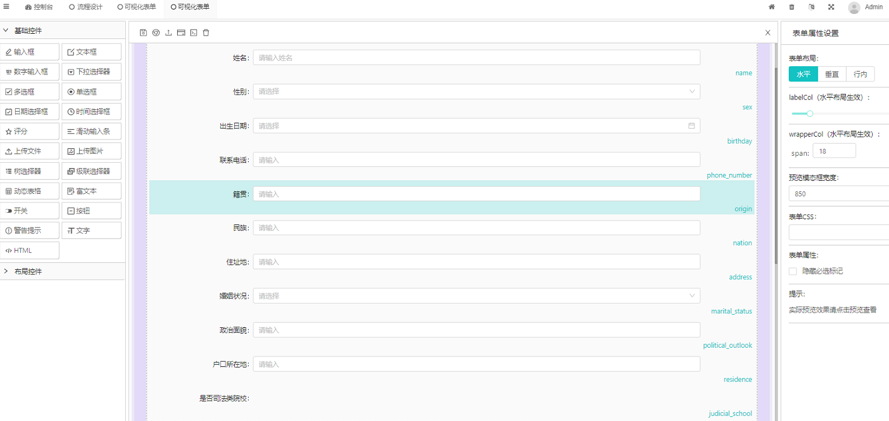  

:-: *图12.可视化配置的自定义表单和界面装修*

数据/业务/表现层分离（前后端分离）。如果全部采用小程序云开发的官方技术体系，云函数、云数据库是与小程序前端耦合在一起的，并不符合此项特性。这可能是对于希望能够一次开发多云部署，能够快速将业务拓展到其他生态体系的SaaS厂商来说是个需要注意的问题。
   

6. 高安全性、高可用性。
得益于去中心化、运营与应用分离、实例间相互独立/资源隔离，在最极端的情况下，即使第三方平台的SaaS运营平台不可用了，也不会影响每个租户的业务持续性。PaaS/IaaS基础设施提供商还有很多云安全、备份、弹性计算的基础设施，可以有效增加租户的安全性和可用性。

7. 适用于所有类型的用户。
你问一个每年只有2000元预算的客户，是否需要源代码是否需要数据私有，他给你的回复大概率都是，“很好，需要！”。其实，客户可能永远都不会去了解源代码，也不关心具体的技术实现，他们只是希望以后业务拓展后，可以预留升级和定制的能力。采用云原生技术体系进行的SaaS应用交付和部署，恰恰可以满足这样的需求。业界也有通识，中小企业的市场是比较难做的，总体规模不大也没什么利润。SaaS产品能够服务腰部和头部的企业才能打开更大的市场空间。大客户项目的实施，不可避免就会有很多定制的需求，无论是对接客户已有的ERP平台，还是同步客户在各个电商平台的数据，基本都得是源码级别的定制开发。采用云原生技术的SaaS应用交付是符合源码和私有数据需求的。对于实现在不同的“实例”上运行不同版本的软件是正确的发展方向。
现在很多SaaS厂商为了实现客户的定制化需求，做了不少PaaS和开放平台方面的尝试，虽然不能说是完全没用，但总感觉不是终极的解决方案。我们也做过PaaS方向的尝试，下图来自UCT商业计划2017年版本的一页。总结起来就是坑多效果少，大概不是正确的方向。
 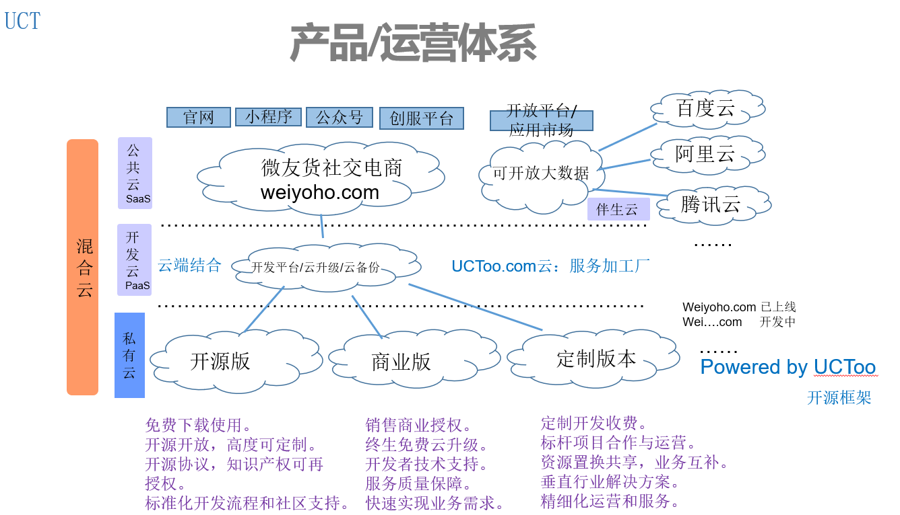  

:-: *图13. UCT商业计划节选*

8. 技术及厂商中立
2015年成立的云原生计算基金会CNCF[[4]](#anchor4 "CNCF云原生计算基金会"),推动了很多云原生技术的发展。厂商中立也是CNCF的一项理念。主流云服务提供商的基础设施也大多采用CNCF涵盖的技术体系进行的定制化实现。对于SaaS厂商来说，想要提高开发成果的通用性，最好也参考云原生技术体系中各个项目主线版本的技术实现，尽量减少采用云基础设施提供商定制部分的技术实现。

9. 社会化生产
生产力决定生产关系。新技术的发展也需要有相匹配的生产方式。UCT从成立之初就确定了开源的理念。我们觉得SaaS厂商开源产品和应用的主线版本，开发者、交付工程师基于合作发展的共同利益，能够自由的参与和贡献能力，并获取收益应该是更先进的生产方式。
当然开源和商业的边界，开源产品的盈利能力和知识产权保护等方面还有很多需要解决和完善的问题。ICT产业的大部分技术都是建立在开源理念的成果之上，方向应该是没有错的。

## SaaS产品的终极形态
虽然我也不确定SaaS产品的终极形态是怎样的。但感觉大致的方向应该是SaaS开发商基于云原生的技术体系，遵循一致的开发规范和协议，进行运营平台和应用实例的产品开发。ISV开发的应用可以在SaaS和PaaS平台间商业化的分发和部署。CNCF涵盖的技术体系和W3C关于web applications、widget等规范[[5]](#anchor5 "SaaS level4 参考规范")都是可以参考的一些技术体系。

以上微信生态的具体实践，相信在阿里、鸿蒙、抖音等生态可能也有对应的解决方案。UCT自成立以来主要在微信生态拓展业务，受限于时间、资源等方面的条件，还未在其他生态进行投入，欢迎其他生态的开发者分享相应生态的最佳实践。

想法可以在天上飞，但是路还是要脚踏实地的一步一步走。UCT基于新的技术体系正在构建level4级的SaaS产品和生态，我们现已开源了运营域的UCToo运营平台框架，项目地址 [gitee.com/uctoo/uctoo](https://gitee.com/uctoo/uctoo) ，应用开发服务器、低代码前端组件等其他相关组成部分正在规划开源中。
云原生技术对构建先进的SaaS产品具有很大的促进作用，同时业界需要更多最佳实践指引新技术的商业化和落地，在此本公司提议成立一个通用云技术开源组织（Universal Cloud Technology Open source Organization），为符合level4级的开源项目提供孵化、技术支持和商业化服务。在此捐赠 [www.uctoo.org](https://www.uctoo.org) 域名用于UCTOO的建设。欢迎业界同行共同参与。

## 参考资料 
1. [https://docs.microsoft.com/zh-cn/archive/blogs/gianpaolo/saas-simple-maturity-model](https://docs.microsoft.com/zh-cn/archive/blogs/gianpaolo/saas-simple-maturity-model)  
2. [https://www.infoq.com/news/2008/02/saas-architecture-maturity-model](https://www.infoq.com/news/2008/02/saas-architecture-maturity-model)  
3. [https://wenku.baidu.com/view/a65b20bdc850ad02df8041f4.html](https://wenku.baidu.com/view/a65b20bdc850ad02df8041f4.html)  
4. [https://www.cncf.io](https://www.cncf.io)  
5. [https://www.w3.org](https://www.w3.org)  

## 后记
1. 参考本文思路开发的SaaS开源项目  [UCToo](https://gitee.com/uctoo/uctoo) https://gitee.com/uctoo/uctoo 
2. cloudbase 一键部署项目 [uctoo-docker](https://gitee.com/UCT/uctoo-docker) https://gitee.com/UCT/uctoo-docker

## CloudBase Framework 开源项目介绍

🚀 CloudBase Framework 是云开发开源的云原生前后端一体化部署工具，支持主流前后端框架，前后端一键托管部署在云端一体化平台，支持支持小程序、Web、Flutter、后端服务等多个平台。

Github 开源地址：[https://github.com/Tencent/cloudbase-framework](https://github.com/Tencent/cloudbase-framework)

欢迎给 CloudBase Framework 一个 🌟 star

## CloudBase Framework 核心贡献者计划

欢迎大家参与 CloudBase Framework 的开发工作，成为我们的贡献者，我们将会在云开发社区展示贡献者的作品和信息，同时也会有惊喜奖励。

您可以选择如下的贡献方式：

- 贡献技术文章：[https://github.com/Tencent/cloudbase-framework/tree/master/community/posts](https://github.com/Tencent/cloudbase-framework/tree/master/community/posts)
- 贡献应用：[https://github.com/Tencent/cloudbase-framework/blob/master/doc/app.md](https://github.com/Tencent/cloudbase-framework/blob/master/doc/app.md)
- 贡献代码，提交 Pull Request
- 反馈 bug，提交 Issue
- 在技术会议上发表技术演讲

CloudBase Framework 的发展离不开社区的积极贡献，这是我们的核心贡献者列表，再次感谢大家的贡献：[https://github.com/Tencent/cloudbase-framework#contributors-](https://github.com/Tencent/cloudbase-framework#contributors-)
